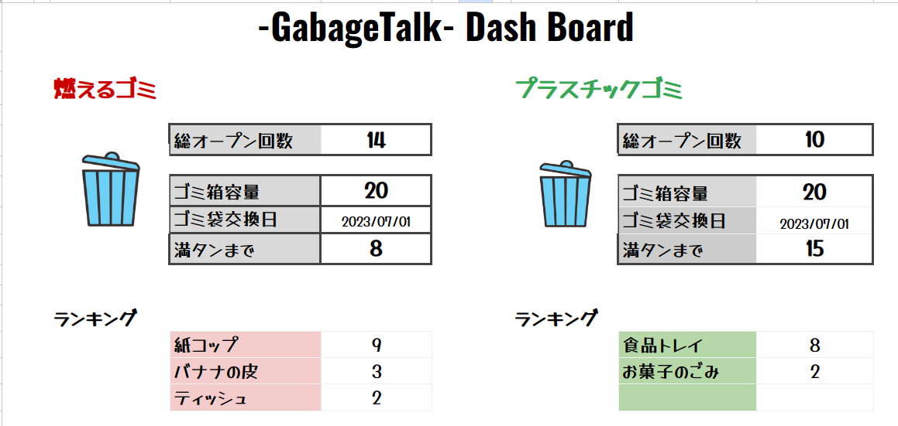

# sse06-k01-group3
Smart SE 6th term K01 group exercise

# Gabage Talk (ガベージトーク)

## 使用方法

1. マイクに向かって手に持っているゴミを声に出す
  - 現在の対応品目
    - 紙コップ
    - バナナの皮
    - ティッシュ
    - 食品トレイ
    - お菓子のごみ 
2. 対応したゴミ箱の蓋がパカっと空きます
   - 燃えるゴミ
     - 紙コップ
     - バナナの皮
     - ティッシュ
   - プラスチック
     - 食品トレイ
     - お菓子のごみ

## ダッシュボード

[こちら](https://docs.google.com/spreadsheets/d/10Y0HR7GheCM4zg23Cxq_TkGvJpp0yrMm7bv4hZ4LIh8/edit?usp=sharing)からご覧いただけます。

### ダッシュボード項目の説明

- 総オープン回数
  - フタがあいた回数
- ゴミ袋交換日
  - ゴミ袋を交換すると満タンまでの数字がリセットされます
- 満タンまで
  - 0になるとゴミ箱がいっぱいになります
  - (MVPではゴミ箱のフタが開かない制御は未実装)
- ランキング
  - 捨てられたものをランキング表示します

